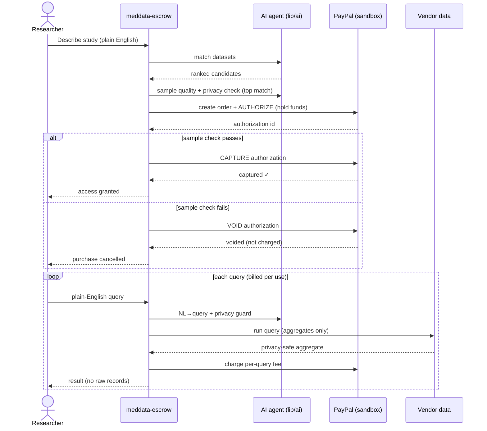

# Architecture

## Overview

meddata-escrow is a single Next.js (App Router) application. The UI (researcher
and vendor workspaces) and the backend (Next.js API routes) live in one
TypeScript codebase. AI logic sits in `lib/ai`, the PayPal integration in
`lib/paypal`, and persistence in `lib/db` (SQLite locally, Postgres in prod).

## Components

| Layer         | Location                                           | Responsibility                                    |
| ------------- | -------------------------------------------------- | ------------------------------------------------- |
| Researcher UI | `app/researcher`                                   | Describe a study, browse matches, query, purchase |
| Vendor UI     | `app/vendor`                                       | List datasets, manage catalog, review orders      |
| API           | `app/api/{match,query,orders,billing}`             | Request handlers                                  |
| AI            | `lib/ai/{matcher,nl2query,privacy-guard}`          | Matching, NL→query, privacy screening             |
| Payments      | `lib/paypal/client`                                | Authorize / capture / void / per-query billing    |
| Data          | `lib/db/{schema.sql,seed.ts}`, `data/catalog.json` | Schema + seed                                     |

## Escrow flow

## Data flow

Raw records never leave the vendor. Queries are compiled to safe, aggregate-only
operations and results pass through the privacy guard before returning.

## API routes

- `POST /api/match` — rank datasets for a study description
- `POST /api/orders` — create order + authorize (escrow hold)
- `PATCH /api/orders` — capture or void after the sample check
- `POST /api/query` — plain-English query → privacy-safe aggregate
- `POST /api/billing` — record + charge per-query usage

## Data model

See [`../lib/db/schema.sql`](../lib/db/schema.sql): `vendors`, `datasets`,
`orders`, `query_usage`.

## Deployment (Render)

Defined in [`../render.yaml`](../render.yaml): a Node web service plus a managed
Postgres instance. Secrets are set in the Render dashboard, never committed.
